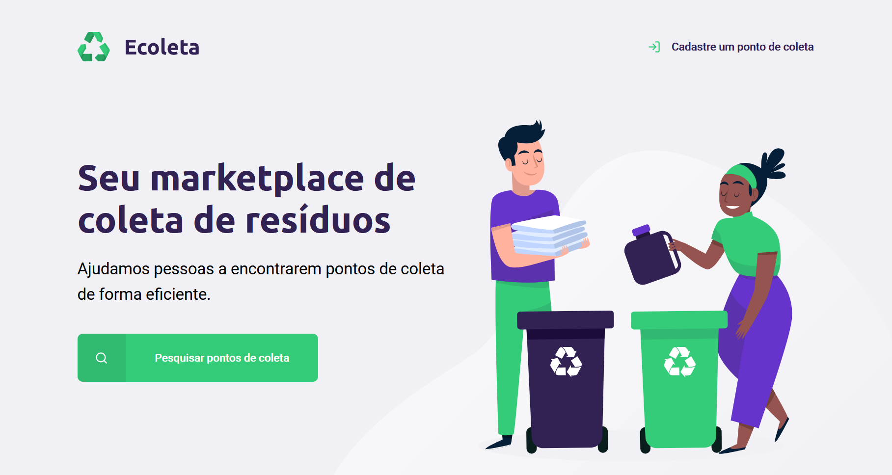

<h1 align="center">
  
   
  Next Level Week da Rocketseat (Starter) 🚀
   
</h1>

<h3 align="center">♻️ Ecoleta</h4>

<h4 align="center">Aplicação para ajudar as pessoas a encontrarem pontos de coleta em sua cidade.</h4>

  

## 💻 Informações:

O Ecoleta é uma aplicação para ajudar as pessoas a encontrarem pontos de coleta para reciclagem em sua cidade. 

Criado usando a ideia de Template Engine e Sqlite para guardar as informações.

As aulas foram ministradas pelo [Mayk Brito](https://github.com/maykbrito) da Rocketseat.

Eu tambem participei da "trilha" [Booster](https://github.com/drawciamage/Next-Level-Week-Booster) da Next Level Week.

## 📝Licença
Este projeto está sob a licença [MIT](LICENSE.md).